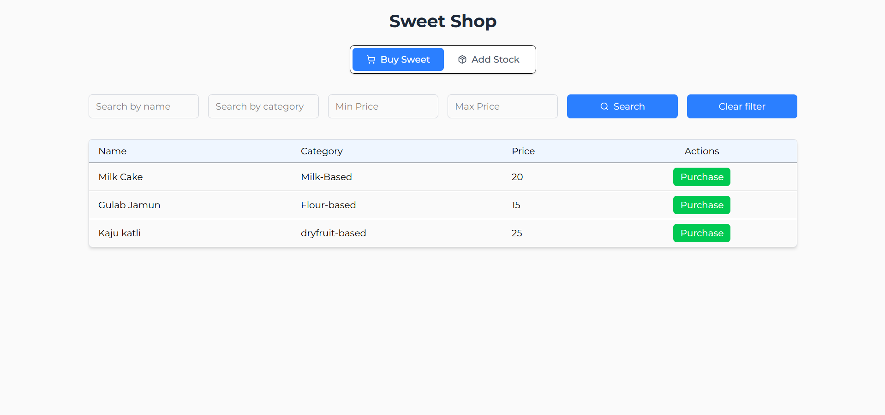
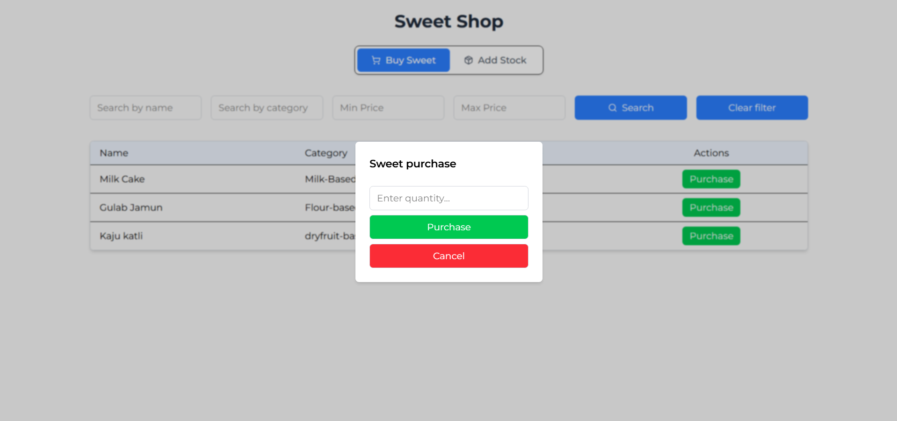
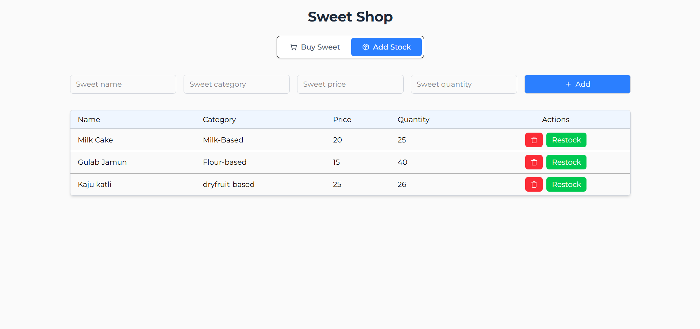
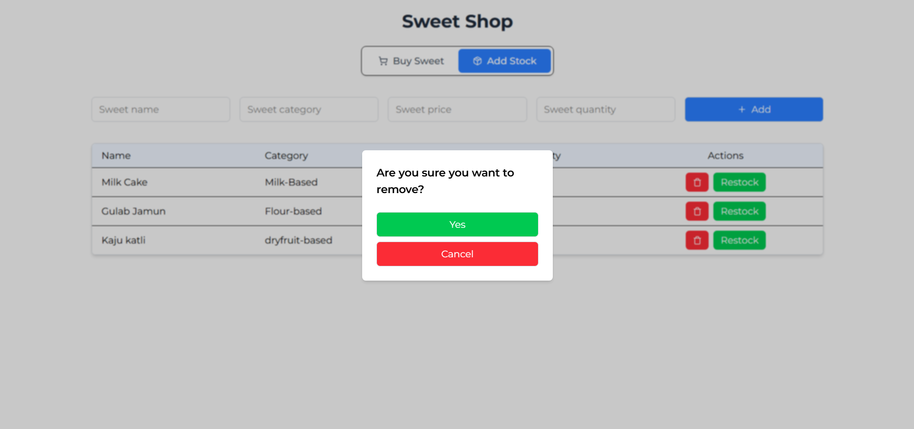
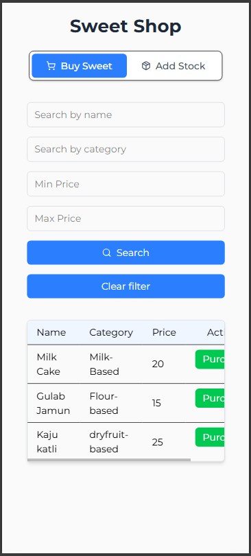
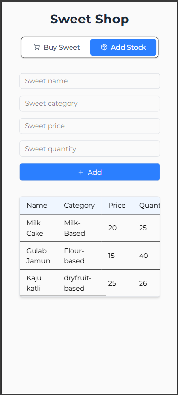

# 🍬 Sweet Shop Management System

A MERN-based web app for managing sweet inventory, including stock, purchase, restock, and filtering by name, category, or price range.

---

## 🪨 Tech Stack

* **Frontend**: React.js, Tailwind CSS
* **Backend**: Node.js, Express.js, MongoDB
* **Testing**: Jest, Supertest

---

## 🔧 Project Structure

```
sweet-shop/
|
|├── sweet-shop-backend/      ← Express + MongoDB
     └── test-report.html     ← Test result summary 
|├── sweet-shop-frontend/     ← React + Tailwind
|├── README.md                ← Main Setup Instructions

```

---

## 🛠️ Setup Instructions

### 1. Clone the Repository

```bash
git clone https://github.com/Keval-13/sweet-shop.git
cd sweet-shop
```

### 2. Install Dependencies

```bash
cd sweet-shop-backend
npm install
```
```bash
cd ../sweet-shop-frontend
npm install
```

### 3. Configure Environment Variables

Create a `.env` file inside `sweet-shop-backend/`

Content of `.env` is shown in `.env.example`

### 4. Run Backend and Frontend

Open two separate terminals from project root: (./sweet-shop)

Terminal 1 (Backend)
```bash
cd ./sweet-shop-backend
npm run dev
```

Terminal 2 (Frontend)
```bash
cd ./sweet-shop-frontend
npm run dev
```

### 5. Open browser and search

```
http://localhost:5173/
```

⚠️ Make sure update MongoDB URI for MongoDB Atlas.


## 📊 Features

* Add new sweets
* Delete sweets
* Restock sweets
* Purchase sweets (update quantity)
* Filter sweets by name, category, and price range

---

## 📃 Test Report

Run & See [`test-report.html`](./sweet-shop-backend/test-report.html) for full test results.

---

## 🧪 Test Report Screenshot


## 🌐 Frontend Preview










## Frontend Mobile Preview



